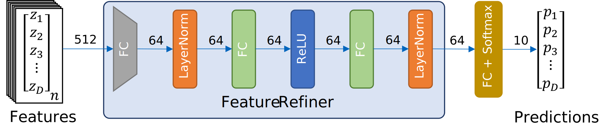
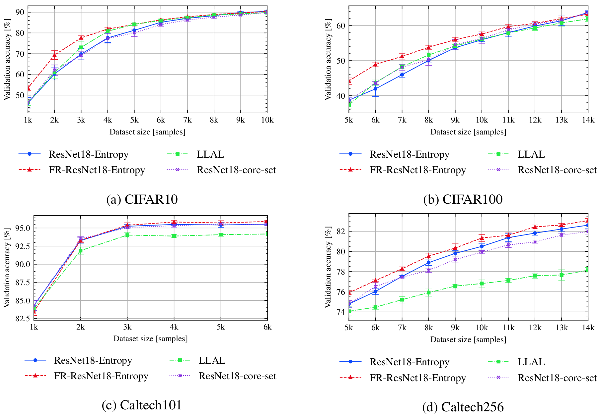

# The Unreasonable Effectiveness of Fully-Connected Layers for Low-Data Regimes
### [Project Page](https://peter-kocsis.github.io/LowDataGeneralization/)

[Peter Kocsis](https://peter-kocsis.github.io/),
[Peter Sukenik](https://scholar.google.com/citations?user=qEhrUDAAAAAJ),
[Guillem Braso](https://dvl.in.tum.de/team/braso/),
[Matthias Niessner](https://niessnerlab.org/members/matthias_niessner/profile.html),
[Laura Leal-Taixe](https://dvl.in.tum.de/team/lealtaixe/),
[Ismail Elezi](https://dvl.in.tum.de/team/elezi/)





## Requirements
### Installation
#### 1. Install Anaconda
To manage the packages easier, we use Anaconda. To install it on the cluster,
call the following command from your home directory:

```bash
wget https://repo.continuum.io/archive/Anaconda3-2020.02-Linux-x86_64.sh
bash ./Anaconda3-2020.02-Linux-x86_64.sh
```

#### 2. Create environment
```bash
conda create -n lowdata python=3.7
```

#### 3. Install the requirements
During our experiments, we used CUDA 11.0. We recommend to use the same to ensure compatibility. Otherwise, please update the requirements file according to your specification. 
```bash
conda activate lowdata
python -m pip install -r ./requirements.txt
```

### Dataset
The datasets are automatically downloaded and prepared during the first run. Datasplit definitions can be found in our [logs](https://syncandshare.lrz.de/getlink/fi8foocnLEgPLQgEQSoo23/neurips_supervised.zip) (data.json).

## Repository structure
### Data
Folder containing the downloaded datasets and data split definitions. 

### External
Module containing external repositories. 

### GUI
Our visualization tool for result analysis. We recommend to use our tool for best overview over the logs of our code. More information can be found in the module. 

### Logs
The logs of the training, together with the trained models. The logs of the experiments presented in the paper can be downloaded from [here](https://drive.google.com/drive/folders/1hDkqxn6PVBmQpjrtQZHZr962ZMbSbOL_?usp=sharing). These logs can be directly visualized with our GUI module. 

### LowDataRegime
This is our main module containing the implementation of our training loop, dataloading and the models.

### Scripts
This module contains helpful scripts for running the trainings in a SLURM cluster environment or locally. 


## Training and evaluation
Our training scripts train, and save the models under the logs folder. It also evaluates the final model on the respective test set. The logs can be easily visualized with our anylitics tool. For further details, please refer to the GUI module. 

We used a SLURM-managed cluster during the project. We provide the scripts for the cluster in the `scripts/cluster` folder. To run on a single machine, change the `cluster` parameter to `local`.

### Supervised learning
#### Training commands
```
bash scripts/submit_benchmark.sh cluster '-rs supervised -desc resnet -m ResNet18 -d cifar10 -ot SGD -nis 1000 -bs 100 -lratemsr 0.8 -nsteps 10000 -qt RandomQuery -tfc'
bash scripts/submit_benchmark.sh cluster '-rs supervised -desc fr -m FeatureRefiner -iidi -d cifar10 -ot SGD -nis 1000 -bs 100 -lratemsr 0.8 -nsteps 10000 -fs 64 -qt RandomQuery -tfc'

bash scripts/submit_benchmark.sh cluster '-rs supervised -desc resnet -m ResNet18 -d cifar100 -nts 10 -ot SGD -nis 5000 -bs 100 -lratemsr 0.8 -nsteps 10000 -qt RandomQuery -tfc'
bash scripts/submit_benchmark.sh cluster '-rs supervised -desc fr -m FeatureRefiner -iidi -d cifar100 -nts 10 -ot SGD -nis 5000 -bs 100 -lratemsr 0.8 -nsteps 10000 -fs 64 -qt RandomQuery -tfc'

bash scripts/submit_benchmark.sh cluster '-rs supervised -desc resnet -m ResNet18 -pt imagenet -d caltech101 -nts 6 -ot SGD -nis 1000 -bs 100 -lratemsr 0.8 -lrate 0.001 -me 100 -qt RandomQuery -tfc'
bash scripts/submit_benchmark.sh cluster '-rs supervised -desc fr -m FeatureRefiner -iidi -pt imagenet -d caltech101 -nts 6 -ot SGD -nis 1000 -bs 100 -lratemsr 0.8 -lrate 0.001 -me 100 -fs 256 -qt RandomQuery -tfc'

bash scripts/submit_benchmark.sh cluster '-rs supervised -desc resnet -m ResNet18 -pt imagenet -d caltech256 -nts 10 -ot SGD -nis 5000 -bs 100 -lratemsr 0.8 -lrate 0.001 -me 100 -qt RandomQuery -tfc'
bash scripts/submit_benchmark.sh cluster '-rs supervised -desc fr -m FeatureRefiner -iidi -pt imagenet -d caltech256 -nts 10 -ot SGD -nis 5000 -bs 100 -lratemsr 0.8 -lrate 0.001 -me 100 -fs 256 -qt RandomQuery -tfc'
```
#### Results


### Active Learning
```
bash scripts/submit_benchmark.sh cluster '-rs al -desc resnet18_entropy -m ResNet18 -d cifar10 -ot SGD -nis 1000 -bs 100 -lratemsr 0.8 -nsteps 10000 -qt UncertaintyQuery -tfc'
bash scripts/submit_benchmark.sh cluster '-rs al -desc resnet18_coreset -m ResNet18 -d cifar10 -ot SGD -nis 1000 -bs 100 -lratemsr 0.8 -nsteps 10000 -qt CoreSetQuery -tfc' 
bash scripts/submit_benchmark.sh cluster '-rs al -desc fr_resnet18_entropy -m FeatureRefiner -iidi -d cifar10 -ot SGD -nis 1000 -bs 100 -lratemsr 0.8 -nsteps 10000 -fs 64 -qt UncertaintyQuery -tfc'
bash scripts/submit_benchmark.sh cluster '-rs al -desc resnet_llal -m ResNet18 -d cifar10 -ot SGD -nis 1000 -bs 100 -lratemsr 0.8 -nsteps 10000 -tt LearningLossTrainer -qt ModelQuery' 

bash scripts/submit_benchmark.sh cluster '-rs al -desc resnet18_entropy -m ResNet18 -d cifar100 -nts 10 -ot SGD -nis 5000 -bs 100 -lratemsr 0.8 -nsteps 10000 -qt UncertaintyQuery -tfc'
bash scripts/submit_benchmark.sh cluster '-rs al -desc resnet18_coreset -m ResNet18 -d cifar100 -nts 10 -ot SGD -nis 5000 -bs 100 -lratemsr 0.8 -nsteps 10000 -qt CoreSetQuery -tfc'
bash scripts/submit_benchmark.sh cluster '-rs al -desc fr_resnet18_entropy -m FeatureRefiner -iidi -d cifar100 -nts 10 -ot SGD -nis 5000 -bs 100 -lratemsr 0.8 -nsteps 10000 -fs 64 -qt UncertaintyQuery -tfc'
bash scripts/submit_benchmark.sh cluster '-rs al -desc resnet_llal -m ResNet18 -d cifar100 -nts 10 -ot SGD -nis 5000 -bs 100 -lratemsr 0.8 -nsteps 10000 -tt LearningLossTrainer -qt ModelQuery' 

bash scripts/submit_benchmark.sh cluster '-rs al -desc resnet18_entropy -m ResNet18 -pt imagenet -d caltech101 -nts 6 -ot SGD -nis 1000 -bs 100 -lratemsr 0.8 -lrate 0.001 -me 100 -qt UncertaintyQuery -tfc'
bash scripts/submit_benchmark.sh cluster '-rs al -desc resnet18_coreset -m ResNet18 -pt imagenet -d caltech101 -nts 6 -ot SGD -nis 1000 -bs 100 -lratemsr 0.8 -lrate 0.001 -me 100 -qt CoreSetQuery -tfc'
bash scripts/submit_benchmark.sh cluster '-rs al -desc fr_resnet18 -m FeatureRefiner -iidi -pt imagenet -d caltech101 -nts 6 -ot SGD -nis 1000 -bs 100 -lratemsr 0.8 -lrate 0.001 -me 100 -fs 256 -qt UncertaintyQuery -tfc'
bash scripts/submit_benchmark.sh cluster '-rs al -desc resnet_llal -m ResNet18 -pt imagenet -d caltech101 -nts 6 -ot SGD -nis 1000 -bs 100 -lratemsr 0.8 -tt LearningLossTrainer -qt ModelQuery -tfc' 

bash scripts/submit_benchmark.sh cluster '-rs al -desc resnet18_entropy -m ResNet18 -pt imagenet -d caltech256 -nts 10 -ot SGD -nis 5000 -bs 100 -lratemsr 0.8 -lrate 0.001 -me 100 -qt UncertaintyQuery -tfc'
bash scripts/submit_benchmark.sh cluster '-rs al -desc resnet18_coreset -m ResNet18 -pt imagenet -d caltech256 -nts 10 -ot SGD -nis 5000 -bs 100 -lratemsr 0.8 -lrate 0.001 -me 100 -qt CoreSetQuery -tfc'
bash scripts/submit_benchmark.sh cluster '-rs al -desc fr_resnet18 -m FeatureRefiner -iidi -pt imagenet -d caltech256 -nts 10 -ot SGD -nis 5000 -bs 100 -lratemsr 0.8 -lrate 0.001 -me 100 -fs 256 -qt UncertaintyQuery -tfc'
bash scripts/submit_benchmark.sh cluster '-rs al -desc resnet_llal -m ResNet18 -pt imagenet -d caltech256 -nts 10 -ot SGD -nis 5000 -bs 100 -lratemsr 0.8 -tt LearningLossTrainer -qt ModelQuery -tfc' 
```
#### Results


### Backbone
```
bash scripts/submit_benchmark.sh cluster '-rs backbone_resnet34 -desc resnet34 -m ResNet34 -d cifar10 -ot SGD -nis 1000 -bs 100 -lratemsr 0.8 -nsteps 10000 -qt RandomQuery -tfc' 
bash scripts/submit_benchmark.sh cluster '-rs backbone_resnet34 -desc fr_resnet34 -m FeatureRefiner -bbm ResNet34 -iidi -d cifar10 -ot SGD -nis 1000 -bs 100 -lratemsr 0.8 -nsteps 10000 -fs 64 -qt RandomQuery -tfc' 
bash scripts/submit_benchmark.sh cluster '-rs backbone_efficientnet -desc efficientnet -m EfficientNetB3 -d cifar10 -ot SGD -nis 1000 -bs 100 -lratemsr 0.8 -nsteps 10000 -qt RandomQuery -tfc'
bash scripts/submit_benchmark.sh cluster '-rs backbone_efficientnet -desc fr_efficientnet -m FeatureRefiner -bbm EfficientNetB3 -iidi -d cifar10 -ot SGD -nis 1000 -bs 100 -lratemsr 0.8 -nsteps 10000 -qt RandomQuery -tfc'
bash scripts/submit_benchmark.sh cluster '-rs backbone_densenet -desc densenet -m DenseNet -d cifar10 -ot SGD -nis 1000 -bs 100 -lratemsr 0.8 -nsteps 10000 -qt RandomQuery -tfc'
bash scripts/submit_benchmark.sh cluster '-rs backbone_densenet -desc fr_densenet -m FeatureRefiner -bbm DenseNet -d cifar10 -ot SGD -nis 1000 -bs 100 -lratemsr 0.8 -nsteps 10000 -fs 64 -qt RandomQuery -tfc'

bash scripts/submit_benchmark.sh cluster '-rs backbone_resnet34 -desc resnet34 -m ResNet34 -d cifar100 -nts 10 -ot SGD -nis 5000 -bs 100 -lratemsr 0.8 -nsteps 10000 -qt RandomQuery -tfc' 
bash scripts/submit_benchmark.sh cluster '-rs backbone_resnet34 -desc fr_resnet34 -m FeatureRefiner -bbm ResNet34 -iidi -d cifar100 -nts 10 -ot SGD -nis 5000 -bs 100 -lratemsr 0.8 -nsteps 10000 -fs 64 -qt RandomQuery -tfc' 
bash scripts/submit_benchmark.sh cluster '-rs backbone_efficientnet -desc efficientnet -m EfficientNetB3 -d cifar100 -nts 10 -ot SGD -nis 5000 -bs 100 -lratemsr 0.8 -nsteps 10000 -qt RandomQuery -tfc'
bash scripts/submit_benchmark.sh cluster '-rs backbone_efficientnet -desc fr_efficientnet -m FeatureRefiner -bbm EfficientNetB3 -d cifar100 -nts 10 -ot SGD -nis 5000 -bs 100 -lratemsr 0.8 -nsteps 10000 -qt RandomQuery -tfc'
bash scripts/submit_benchmark.sh cluster '-rs backbone_densenet -desc densenet -m DenseNet -d cifar100 -nts 10 -ot SGD -nis 5000 -bs 100 -lratemsr 0.8 -nsteps 10000 -qt RandomQuery -tfc'
bash scripts/submit_benchmark.sh cluster '-rs backbone_densenet -desc fr_densenet -m FeatureRefiner -bbm DenseNet -iidi -d cifar100 -nts 10 -ot SGD -nis 5000 -bs 100 -lratemsr 0.8 -nsteps 10000 -fs 64 -qt RandomQuery -tfc'
```
#### Results


### Ablation
```
bash scripts/submit_benchmark.sh cluster '-rs ablation_architecture -desc 1_onelayer_nodimred -m FeatureRefiner -d cifar10 -ot SGD -nis 1000 -bs 100 -lratemsr 0.8 -nsteps 10000 -fs 512 -qt RandomQuery -tfc -dn1 True -dl1 True -dl2 True -dn2 True'
bash scripts/submit_benchmark.sh cluster '-rs ablation_architecture -desc 2_onelayer_dimred -m FeatureRefiner -d cifar10 -ot SGD -nis 1000 -bs 100 -lratemsr 0.8 -nsteps 10000 -fs 64 -qt RandomQuery -tfc -dn1 True -dl1 True -dl2 True -dn2 True'
bash scripts/submit_benchmark.sh cluster '-rs ablation_architecture -desc 3_fr_nolayernorm -m FeatureRefiner -d cifar10 -ot SGD -nis 1000 -bs 100 -lratemsr 0.8 -nsteps 10000 -fs 64 -qt RandomQuery -tfc -dn1 True -dn2 True'

bash scripts/submit_benchmark.sh cluster '-rs ablation_nogradgate -desc fr -m FeatureRefiner -gm 1.0 -iidi -d cifar10 -ot SGD -nis 1000 -bs 100 -lratemsr 0.8 -nsteps 10000 -fs 64 -qt RandomQuery -tfc'

bash scripts/submit_benchmark.sh cluster '-rs ablation_numlayer -desc fr_2layers -m FeatureRefiner -nil 2 -iidi -d cifar10 -ot SGD -nis 1000 -bs 100 -lratemsr 0.8 -nsteps 10000 -fs 64 -qt RandomQuery -tfc'
bash scripts/submit_benchmark.sh cluster '-rs ablation_numlayer -desc fr_3layers -m FeatureRefiner -nil 3 -iidi -d cifar10 -ot SGD -nis 1000 -bs 100 -lratemsr 0.8 -nsteps 10000 -fs 64 -qt RandomQuery -tfc'
bash scripts/submit_benchmark.sh cluster '-rs ablation_numlayer -desc fr_4layers -m FeatureRefiner -nil 4 -iidi -d cifar10 -ot SGD -nis 1000 -bs 100 -lratemsr 0.8 -nsteps 10000 -fs 64 -qt RandomQuery -tfc'
bash scripts/submit_benchmark.sh cluster '-rs ablation_numlayer -desc fr_5layers -m FeatureRefiner -nil 5 -iidi -d cifar10 -ot SGD -nis 1000 -bs 100 -lratemsr 0.8 -nsteps 10000 -fs 64 -qt RandomQuery -tfc'
```
#### Results


### Citation
If you find our work useful in your research, please cite:
```
@inproceedings{kocsis2022lowdataregime,
               author = {Peter Kocsis
                         and Peter S\'{u}ken\'{i}k
                         and Guillem Bras\'{o}
                         and Matthias Nie{\ss}ner
                         and Laura Leal-Taix\'{e}
                         and Ismail Elezi},
               title = {The Unreasonable Effectiveness of Fully-Connected Layers for Low-Data Regimes},
               booktitle = {Proc. NeurIPS},
               year={2022}
               }
```

### Contact
If you have any questions, please email Peter Kocsis at peter.kocsis@tum.de.