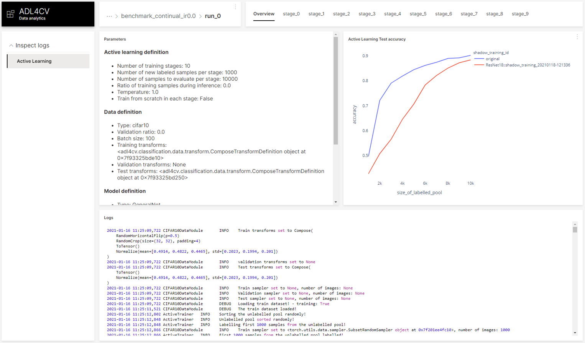
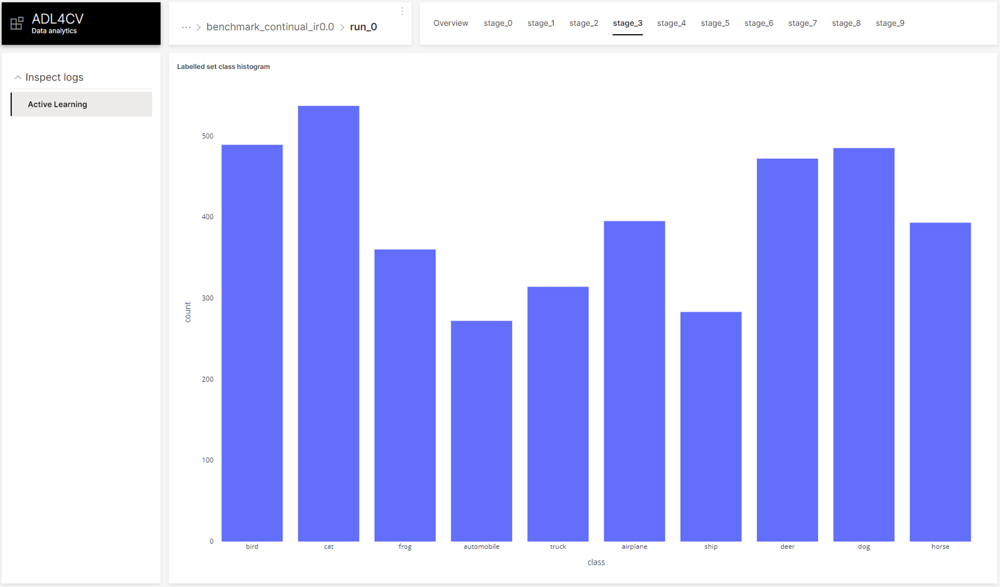

# ADL4CV Analytics

This module is implemented with [H2O Wave SDK](https://h2oai.github.io/wave/) - *Realtime web apps and dashboards for Python*.
The aim of the module is to provide a flexible, dynamic framework for visualizing training results. Our application gathers all the results found in the `logs` folder and visualizes them. You can find the logs of our main run [here](https://syncandshare.lrz.de/getlink/fi8foocnLEgPLQgEQSoo23/neurips_supervised.zip).

## Installation
We are using [H2O Wave 0.13.0](https://github.com/h2oai/wave/releases/tag/v0.13.0) and provide the built binaries for Linux in this folder. For running on Windows/Mac, please refer to the documentation of H2O Wave. 

## Usage 

To start the H2O Wave web server and our Analytics application, we created a stand-alone script.
Open a new terminal from this folder and call the following command:
```bash
. ./start_gui.sh
```


## Example UI

